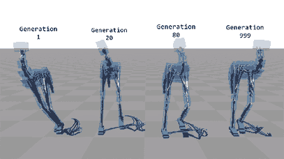

# Robozzle Puzzle Solver using Evolutionary Algorithm

## A solution to the Robozzle puzzle game using an Evolutionary Algorithm (EA).

### What is Robozzle?

Robozzle is a game about programming a robot to collect stars on a grid using a context-sensitive programming language. The game consists of multiple user-designed puzzles, each with its own grid layout and constraints. The grid is a 12x16 array of tiles, where each tile may be one of three colors (red, green, or blue) or empty, and may have a star on it. The objective is to instruct the robot to collect all the stars in the puzzle.

The robot is programmed using a set of symbols, arranged into functions. The number and length of functions can be controlled by the puzzle designer and is specified in the puzzle. There are a maximum of five functions, each with a maximum length of 10 symbols. At the start of the program execution, the first function is pushed onto the stack. There are 11 symbols in total, including: forward, left, and right; one symbol for each function; and three marker symbols. The designer can specify which marker symbols are available. A function symbol pushes its respective function onto the stack. A marker symbol colors the tile the robot is standing on in the color of the marker.

Each symbol can either be gray or colored. If it is gray, it is executed whenever it is popped off the stack. If it is colored, it is only executed if its color matches the color of the tile on which the robot is currently standing.

### How to Use this EA to Solve Robozzle Puzzles

To solve a Robozzle puzzle using this EA, you can represent the program as a string of symbols and use the EA to optimize the program to collect all the stars in the puzzle.

One way to do this is to define a fitness function that measures how close the program is to solving the puzzle. This could include factors such as the number of stars collected, the distance traveled, and possibly other factors such as the number of function calls or marker placements.

To generate new candidate programs, the EA can use various mutation and crossover operators to alter the existing program string. For example, you can randomly insert, delete, or swap symbols, or alter the color of existing symbols. You can also define additional operators such as changing the function structure or adding or removing entire functions.

The EA can then iteratively apply these operators to generate new programs, evaluate their fitness using the fitness function, and select the best programs to use as parents for the next generation. This process can be repeated until the EA finds a program that solves the puzzle or reaches some predefined stopping criterion.

It's worth noting that this is just one possible approach to using an EA to solve Robozzle puzzles, and there are many ways to design and implement the EA. The specific details will depend on the requirements and constraints of the problem, as well as the available resources and expertise.

### Pros and Cons of Using an EA for Robozzle

Using an EA to solve Robozzle puzzles has several advantages and disadvantages.

One advantage is that an EA can potentially find good solutions to complex Robozzle puzzles efficiently. EAs can explore a wide range of possible solutions and adapt to changing conditions, which may be useful in puzzles with complex or dynamic layouts. Additionally, EAs can often find solutions that are not immediately obvious to a human programmer and may be able to discover creative approaches to solving the puzzle.

However, there are also several limitations to using an EA for Robozzle. One disadvantage is that EAs can be slower and more resource-intensive than some other approaches, such as brute force search or heuristics. Additionally, EAs may require careful design and implementation to achieve good results, and there may be a trade-off between the quality of the solution and the time and resources required to find it.

It's important to carefully consider the trade-offs and limitations of different approaches before deciding on a solution strategy. This may involve evaluating the complexity of the problem, the desired performance and accuracy, and the available resources and time constraints.

No matter what approach you choose, it's important to carefully design and test your solution to ensure that it works correctly and efficiently. This may involve writing code to simulate and test the robot's behavior, as well as debugging and optimizing the solution as needed.

## Why I made it

Because I don't have the brain power to solve these puzzles on my own, so I asked the computer to help me out!

Kidding aside, Evolutionary Algorithms can be a powerful tool for solving complex optimization problems, and I was interested in applying this technique to the Robozzle puzzle game. It was a fun challenge to design and implement the EA, and I hope it can be useful for other puzzle enthusiasts looking to automate their solution search.

So if you're tired of staring at your screen trying to come up with the perfect Robozzle program, give this EA a try and let the computer do the hard work for you!

## Demo

